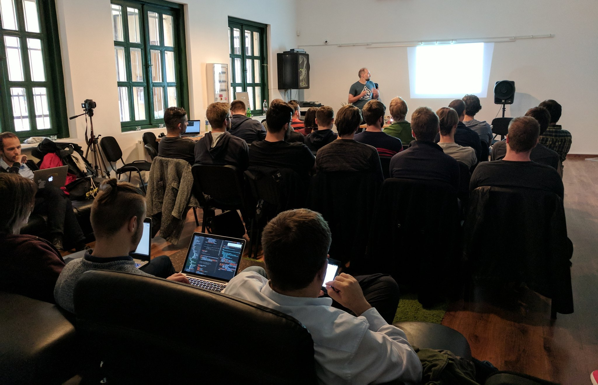
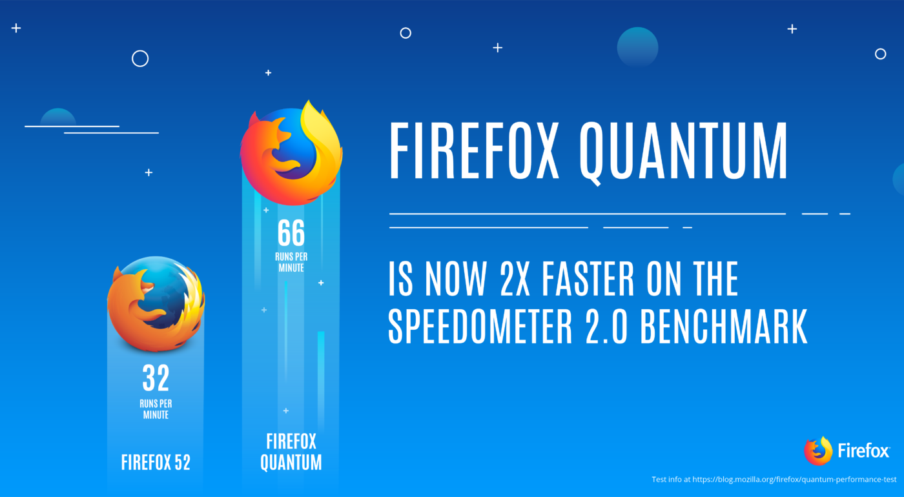
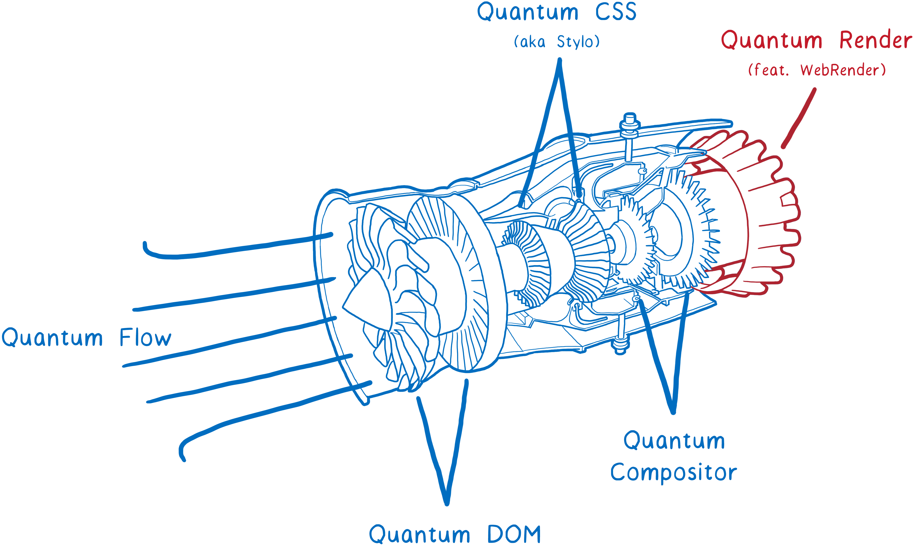

# Mozilla Developer Roadshow-val folytatódik a magyar Rust meetup-sorozat

Szeptemberben indult útjára a [Rust Hungary meetup](https://www.meetup.com/Rust-Hungary-Meetup/) amely a [Rust programozási nyelv](http://rust-lang.org) magyar közösségét hivatott megszólítani. Az első meetup kiválóan sikerült, az előadók és előadások pozitív fogadtatása után máris nyilvánvaló volt, hogy nem kell majd sokat várni a folytatásra.

**[Indul az első Rust Hungary meetup!](https://twitter.com/RustHungary/status/911587218682150913)**

Ez így is lett, hiszen egy kiadós és pihentető hosszú hétvégét követően jövő héten kedden (Október 24.) máris érkezik a második felvonás a [Mozilla Developer Roadshow](http://mzl.la/devroadshow)-val karöltve!

A Mozilla Developer Roadshow a Mozilla egész éves eseménysorozata amelynek keretében Mozilla fejlesztők és a nyílt web más támogatói látogatnak el különböző városokba világszerte hogy ott modern webes technológiákról adjanak elő és beszélgessenek a helyi fejlesztőközösség tagjaival.

Mindez a Budapesti esemény tekintetében sem lesz másként, vendégünk lesz többek között Nicolas Silva aki a Mozilla párizsi központjában a Firefox grafikus alrendszerének fejlesztésén dolgozik és a novemberben érkező Firefox Quantumról fog előadni. Ezen túl a (szintén jövő héten megrendezésre kerülő) [JSConf Budapest](http://jsconfbp.com/) webes fejlesztői konferenciáról is érkeznek vendégelőadóink, sőt, visszatér a Szegedi Egyetem csapata is hogy a legújabb kutatásukról számoljanak be.

A programról további részleteket [az esemény meetup oldalán](https://www.meetup.com/Rust-Hungary-Meetup/events/244086300/) találtok, s jelentkezni szintén itt tudtok, kedvcsinálóként azonban az egyik témánkat itt is kiemelnénk:

A Szegedi Egyetem csapata az utóbbi hónapokban egy igencsak jövőbe mutató technológián dolgozik, a Servo "WebRender" grafikus megjelenítőmotoron, amely a Firefox Quantum Render modulját fogja adni a jövőben. Nicolas Silva maga is ezen a technológián dolgozik (ő a párizsi kontingens vezető fejlesztője), és anélkül hogy a részletekbe belemennénk, bátran állíthatjuk hogy a webfejlesztés világát egészen fundamentális módon fogja befolyásolni az a teljesítménynövekedés amellyel a WebRender technológia kecsegtet.

Ha többet szeretnétek megtudni erről (és nem szeretnétek a délutánt [Lin Clark a WebRenderről szóló, elképesztően részletes írásával](https://hacks.mozilla.org/2017/10/the-whole-web-at-maximum-fps-how-webrender-gets-rid-of-jank/) tölteni akkor gyertek el kedden a meetupra!

Azt, hogy nem árulunk zsákbamacskát, azt Jake Archibald, a Google Chrome böngésző(!) egyik vezető evangelistájának tweetjével szeretnénk illusztrálni, aki még 2016-ban csak ennyit nyilatkozott az (akkor még csak kísérleti jelleggel fejlesztett) WebRender-t használó Servo böngészőmotorról:

> [Wow, Servo is FAST!](https://twitter.com/jaffathecake/status/705355715414781953)

Beágyazott videó:
https://www.youtube.com/watch?v=u0hYIRQRiws

